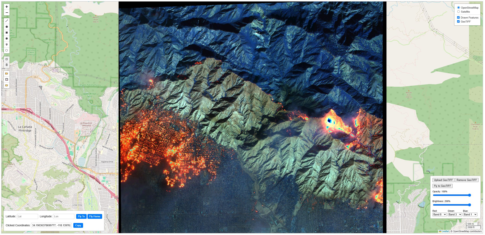

# WebGIS

  01/08/2025 SWIR image of the LA (Altadena) wildfire. Source: Maxar Open Data Program

----

run locally with `python -m http.server 8000`

open browser and go to `http://localhost:8000/`

----

### To Do:
- [x] ~~Handle 4+ band GeoTIFF~~
- [x] ~~Add additional bands to the R, G, B band selector~~
- [x] ~~Implement histogram clippling for raster layers (e.g., 2%-98%)~~
- [ ] Implement dynamic user selected percent clip values, add lower/upper bound box to rasterControlPanel
- [ ] Calculate min/max values for each band in the image vs 1st 3 bands/arrays
- [ ] User controlled style of drawn features
- [ ] Center click and pan while drawing a feature
- [ ] Attribute pop up when clicking a feature
- [ ] Edit attributes in pop up
- [ ] UUID/DTG for default GeoJSON file name
- [ ] Button to zoom to active drawn features (similar to zoom to GeoTIFF/Coords/Home)
- [ ] Fix bug where switching shapes gets "stuck" until clicking off previous shape type or random feature drawn before continuing
- [ ] Develop backend python/gdal process to ensure uploaded GeoTIFFs are proper formats for display (e.g., EPSG 4326/3857, byte scaled, COG, internally tiled, compression, etc.)
- [ ] Add Raster layer from external web source
- [ ] Add vector layer from database
